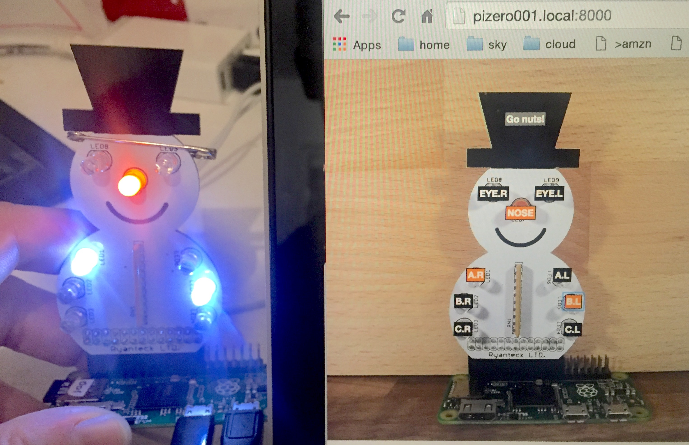

# WebIOSnowPi

Simple [WebIOPi](http://webiopi.trouch.com/) interface for a [Ryanteck SnowPi](https://ryanteck.uk/raspberry-pi/114-snowpi-the-gpio-snowman-for-raspberry-pi-0635648608303.html).

## Instructions

1. Follow the WebIOPi [installation instructions](http://webiopi.trouch.com/INSTALL.html), including setting WebIOPi to auto start at boot
1. Clone this repo to /home/pi/webiosnowpi
  * i.e. `cd ~ && git clone https://github.com/adamcohenrose/webiosnowpi.git`
1. If this is the first time you have installed WebIOPi, then copy the `webiopi-config` file on top of your existing `/etc/webiopi/config` file
  * i.e. `sudo cp webiopi-config /etc/webiopi/config`
  * If you already have a WebIOPi config file you want to keep, just copy across the "SnowPi setup" part of the `[GPIO]` section and the "doc-root" setting in the `[HTTP]` section
1. Start up WebIOPi: `sudo service webiopi start`
1. Go to your WebIOPi home page from a browser
  * it's a good idea to install avahi-daemon so you can get to your Pi by name rather than having to figure out its IP address
1. Click on the buttons and watch the lights go on and off
1. Now edit `snowpi/index.html` and make your own light display!

## Makes a great Xmas jumper!

